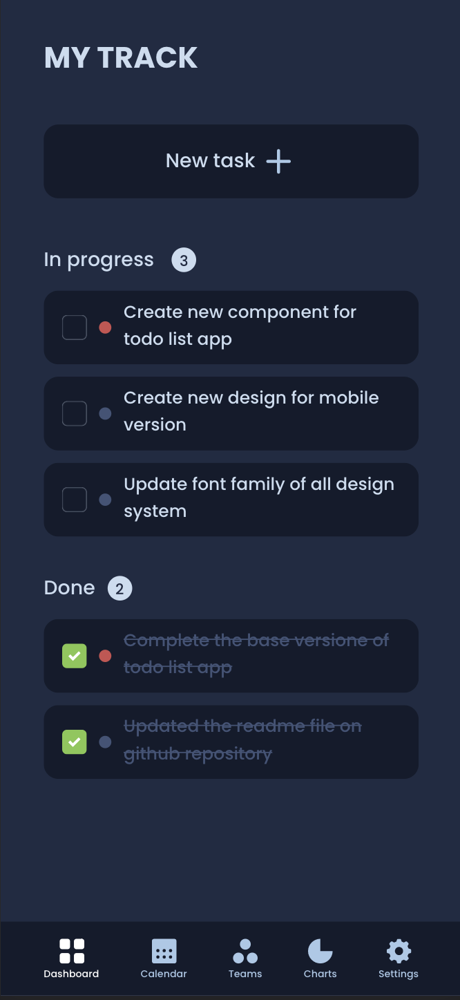
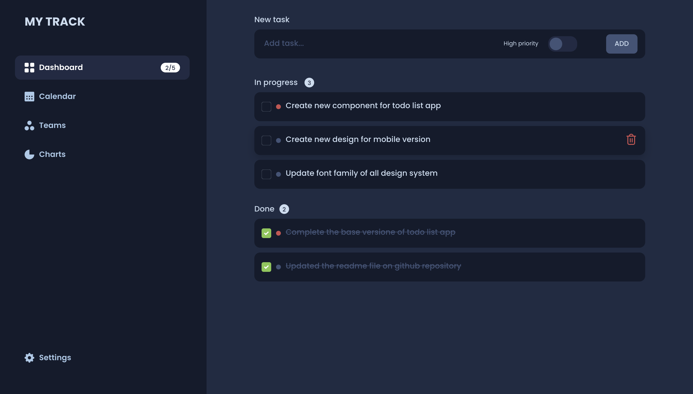

# TODO

## Name project
Todo List

## Description 
Used Html, Scss (with BEM methologies) and vanilla Javascript.

Organized the scaffold of scss files and partialized the js files, created a build with [Parceljs](https://parceljs.org/) tool.

Deployed the build on [Vercel](https://vercel.com/).

[Here](https://sariodesign.dev) you can see the last version deployed.

## Image preview

### Mobile version

### Desktop version

## Local preview
For see the project on your machine:

run: `npm i` and after run: `npm run dev`
